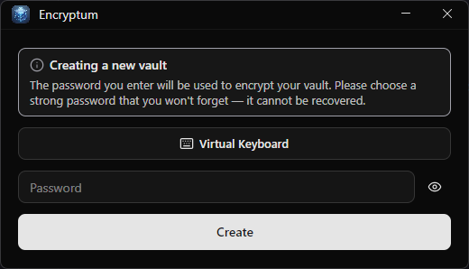
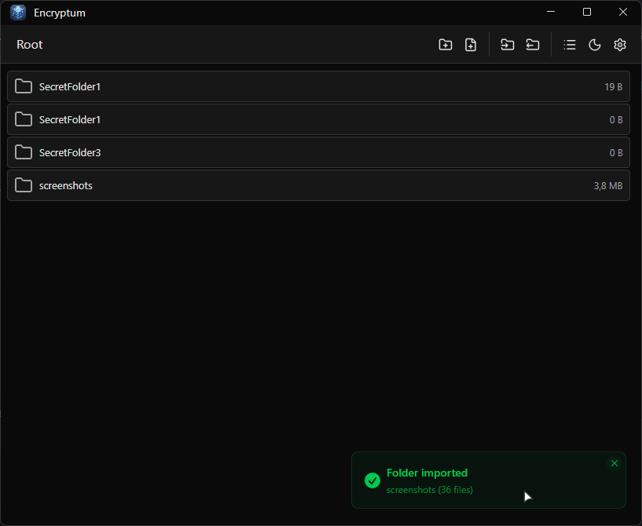

# Encryptum

Encryptum is an encrypted explorer-style app for Windows.
It lets you create folders/files inside a virtual vault and import existing files from your real file system.
All vault data is stored in one encrypted file: `vault.dat`.
Its primary use case is keeping text files and other sensitive files in an encrypted, password-protected vault.

## Screenshots

<p align="center">
  
  &nbsp;&nbsp;
  
</p>

## How It Works

1. You enter a password on startup.
2. A key is derived from your password (PBKDF2).
3. The app decrypts `vault.dat` into memory.
4. Every change is saved back to `vault.dat` as encrypted data (AES-256-GCM).

## What You Can Do

### Explorer-style workflow
- Browse folders with breadcrumbs, similar to a regular file explorer
- Switch between **Grid** and **List** views
- Use multi-select (`Ctrl+Click`, `Shift+Click`)
- Use context menus for common actions

### Manage vault content
- Create folders and files inside the vault
- Rename and delete items (with confirmation)
- Copy / cut / paste items across folders
- Move items by internal drag-and-drop

### Import and export
- Import single files from disk
- Import full folders recursively (directory structure is preserved)
- Drag files/folders from Windows Explorer directly into Encryptum
- Export one file directly to disk
- Export multiple items as a ZIP archive

### Edit and open files
- Edit supported text files inside the built-in editor
- Prompt to save when closing with unsaved changes
- Open any vault file externally with the default app

### Convenience features
- Login screen virtual keyboard (QWERTY)
- Minimizing hides the app to the system tray (closing exits)
- Run at Windows startup
- Light/Dark theme switching

## Limits

- Maximum total vault size: **1 GB**

## Security

| Component | Detail |
|---|---|
| Encryption | AES-256-GCM (authenticated encryption) |
| Key derivation | PBKDF2 with SHA-256, 600,000 iterations |
| Salt | 16 bytes, random per save |
| Nonce | 12 bytes, random per save |
| Vault format | `[4B magic "ENCV"][1B version][16B salt][12B nonce][ciphertext + 16B GCM tag]` |
| Versioning | A format version byte selects the KDF parameters, so iteration counts can change without breaking existing vaults. Files written before versioning (no magic) are read as version 0 and re-saved in the current format. |
| Password storage | Password is not stored; key is derived from user input each session |

If `vault.dat` is modified, decryption/integrity validation fails.

## Important Note

Vault data stays encrypted at rest.
When you use **Open Externally**, the app must write the decrypted file to a temporary folder (`%TEMP%\Encryptum`) so another program can open it. The app deletes it on a best-effort basis: shortly after the external app opens it, on exit, and again on next startup. However, while the external program holds the file — or if Encryptum crashes — the plaintext can persist on disk until the next cleanup. The external program may also keep its own cache. Treat **Open Externally** as exposing that file to your system.

## Tech Stack

- .NET 10.0
- Avalonia 11 (MVVM)
- CommunityToolkit.Mvvm
- ShadUI (local project reference)
- Lucide.Avalonia
- Target runtime: `win-x64`

## Build and Run

```bash
dotnet build -v m
dotnet run -v m
```

## License

MIT License. See `LICENSE`.
